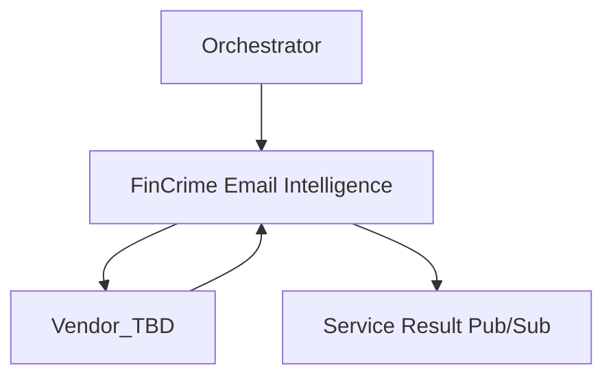

# FinCrime Email Intelligence
This repository is a microservice for Email Intelligence.

## Purpose
This system is used to consult important information from partners about customer's email.

## Observability

### Datadog Dashboard
TBD

### Monitors
- Memory is above 75% of limit for past 5 minutes
- Alert for high p50 latency
- Alert for high p99 latency
- Excessive errors logged
- Health Check Failure (drops below 60% of total allocated instances)
- Has a high error rate
- CPU is above 80% of limit for past 5 minutes

### Health Check
TBD

### Dependencies


## Team Contact Information
- Slack Channel: #team-tmj
- Alerts Channel: #fincrime-fraud-aml-alerts
- Email group: questrade-scrumteam-tmj@questrade.com

## Production readiness
[Checklist link](productionreadiness.md)

### Running Unit Test
```
dotnet test  src/Questrade.FinCrime.Email.Intelligence.Tests.Unit/Questrade.FinCrime.Email.Intelligence.Tests.Unit.csproj
```

### Running Integration Tests
Before executing the integration tests locally we'll need to execute the following command in terminal:
```
docker-compose -f ./docker/dev-environment/docker-compose.yml up -d
```

This will create and run one container in background:
- email-intelligence-pubsub-emulator

Our integration tests will use this emulator to create our temporary topics, subscriptions and to publish any necessary messages to the tests, in a safe and controlled local environment.

## More information
For further information, please check the [project Confluence page](https://confluence.questrade.com/display/FINCRIME/FinCrime+Email+Intelligence).
